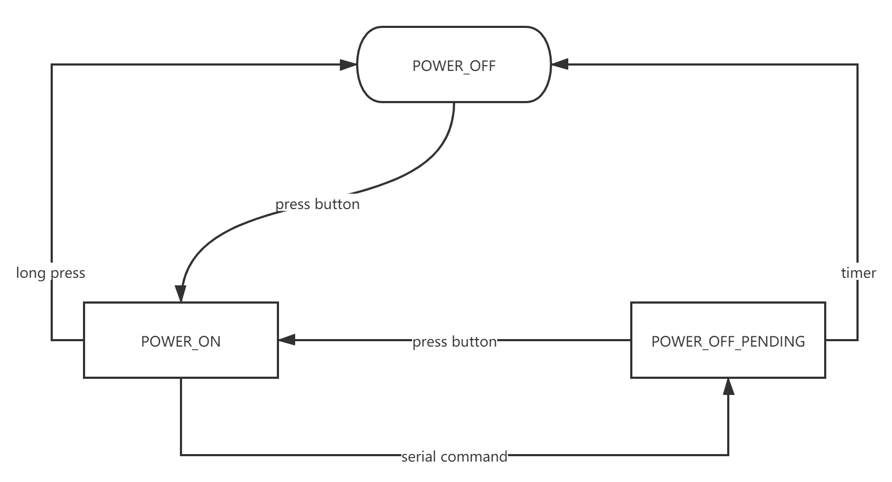

# [Readme in English](./README.en.md)

Simple power management module for Raspberry Pi based on Arduino + MosFET

# 起因


一直以来，我们都是通过插拔电源的方式来控制树莓派的启停，加电即开机，关机却不断电，这让我想到2000年以前，在586横行的年代，执行关机命令后，等待屏幕提示然后按下开关关闭电源，这个姿势实在不够优雅！

对于树莓派的电源管理我有一些困惑：

- 如果关机不断电，**持续光污染、持续风噪、持续耗电**，符合红色99级能效标识吗？
- 即使通过插拔或开关来断电，那么执行 `shutdown` 后等 **多少秒** 后才能安全断电？
- 为什么断电操作需要 **人类手动执行？**

其本质上，树莓派系统缺乏 `ACPI` 高级电源管理支持。

# 方案

所以我决定为树莓派设计一套低成本的自定义硬件方案，模仿ACPI高级电源管理特性，可以很好的解决这个不大不小的麻烦，下面分享我的解决方案。

## 设计目标

- 无需树莓派中运行任何程序或触发
- 与树莓派之间具有最少的物理连接
- 参考ATX/ACPI电源管理特点
- 基于低廉的硬件设施，并易于组装实现
- 长时间、低功耗、高可靠的运行

不能满足以上要求的电源管理都是耍流氓，以上每一条都是该方案严格遵守的，亦是方案优点。

## 功能特性

1. 按下电源按钮优雅开机，而不是上电立即开机
2. 当树莓派关机，延迟后自动断电，无需人类操作电源断开
3. 在供电期间，长按电源按钮可以强制断电
4. 在延迟断电期间，按下电源按钮取消延迟断电

这是 **已实现的特性**，以后会考虑升级软硬件方案增加更多特性。

## 原理图


## 所需模块

- 大功率 DC-DC 转换模块（例如 LM2596 XL4005 XL6009 MP1584 等）
  - 如果是高于5V供电则为降压模块
  - 如果是直接5V供电则不需要
  - 如果是低于5V供电则为升压模块（例如3.7V锂电池）
- Arduino Pro Mini (5V, 16MHz)
- LR7843 MosFET (或其它大功率型号，建议选择Mos模块)
- 按钮、插头、导线等

参考：总成本应该在20元左右。

## 状态机



## 触发条件

该电源管理的核心就是状态转换，选择可靠并易实现的条件边缘是方案成功的核心因素：

### 供电

- [x] 按钮触发
- [ ] *定时触发（TODO1）* 

### 断电

- [x] 按钮触发
- [x] 串口终端的 Kernel log
- [ ] *供电电流降低（TODO2）*

备注：对于TODO1需要增加RTC时钟，对于TODO2需要增加霍尔传感器。

# 如何安装

1. 按照原理图安装好电路模块，注意引脚连线
2. 向 `Arduino` 写入本仓库提供的 `rPiPwrMngt.ino` 程序
3. 通过 `raspi-config` 启用树莓派串口 `serial`

如果你手脚伶俐，应该可以在1-2小时完成安装。

# 自定义安装

如果你并非按照图示中的针脚连接，请根据实际情况修改定义：

```c
// the pin number of MosFET module
const int PIN_RELAY = 7;
// the pin number of power button
const int PIN_POWER_BTN = 4;
```

