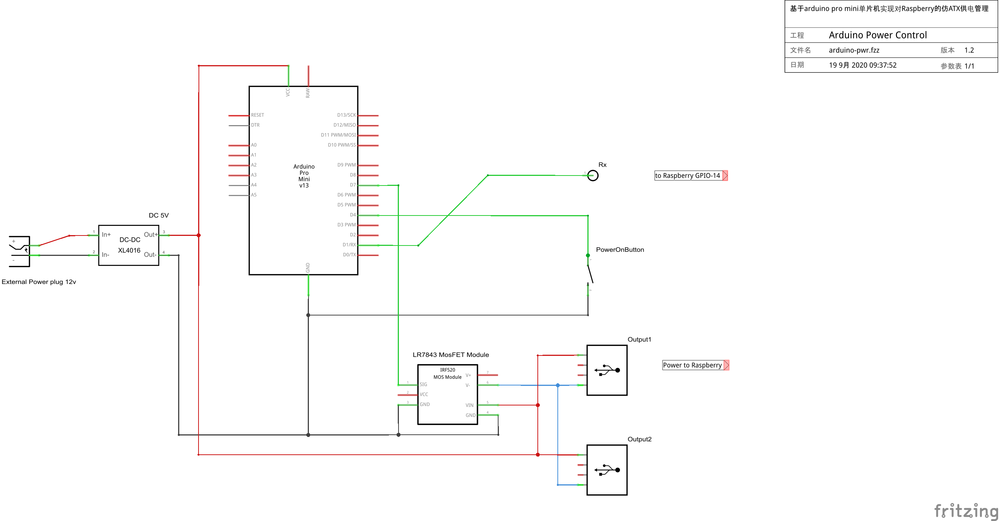

# 项目背景

一直以来我们都是通过插拔电源的方式来实现树莓派的电源管理，加电即开机，关机却不断电，彷佛回到2000年左右，在486/586横行的年代，执行关机命令后，等待屏幕提示然后按下电源键关闭电源，这个姿势实在不够优雅！


所以我为树莓派实现了类似于ATX电源管理的模块解决这个困扰我很久的麻烦，这里我使用了 `Arduino` 单片机控制开闭逻辑和大功率 `MosFET` 管做电源开关。

# 功能目标

1. 按下电源按钮开机，而不是上电立即开机
2. 当树莓派关机后，在20秒定时后断电
3. 在供电期间，长按电源按钮则立即断电
4. 在延迟关机期间，按下电源按钮取消延迟断电

# 设计细节
## 原理图



## 所需模块

- 大功率 DC-DC 降压模块（如果是直接DC5V供电则不需要）
- Arduino Pro Mini (5V, 16MHz)
- LR7843 MosFET (或其它大功率Mos管)
- 按钮、插头、导线等

## 状态机

```
  
                    ┌─────────────┐
                    │  POWER_OFF  │
                    └──────┬──────┘
                           │ <press button>
                      ┌────┴─────┐
                      │ POWER_ON ├────────────────────────────────────┐
                      └────┬─────┘                                    │
                           │                                          │
                ┌──────────┴───────────┐                              │
   <long press> │                      │ <serial command>             │
                │             ┌────────┴───────────┐                  │
                │             │  POWER_OFF_PENDING │                  │
                │             └────────┬───────────┘                  │
                │       <timer>        │       <press button>         │
                │     ┌────────────────┴──────────────────────────────┘
                │     │                
           ┌────┴─────┴────┐                          
           │   POWER_OFF   │                 
           └───────────────┘
  
```

## 触发条件

### 供电

- 按钮触发
- 定时触发（TODO 需要RTC时钟模块）

### 断电

- 按钮触发
- 串口终端的 Kernel log
- 通过霍尔电流传感器（TODO）

# 安装

1. 按照原理图安装好电路模块
2. 向 `Arduino` 写入程序
3. 通过 `rasp-config` 打开树莓派串口
