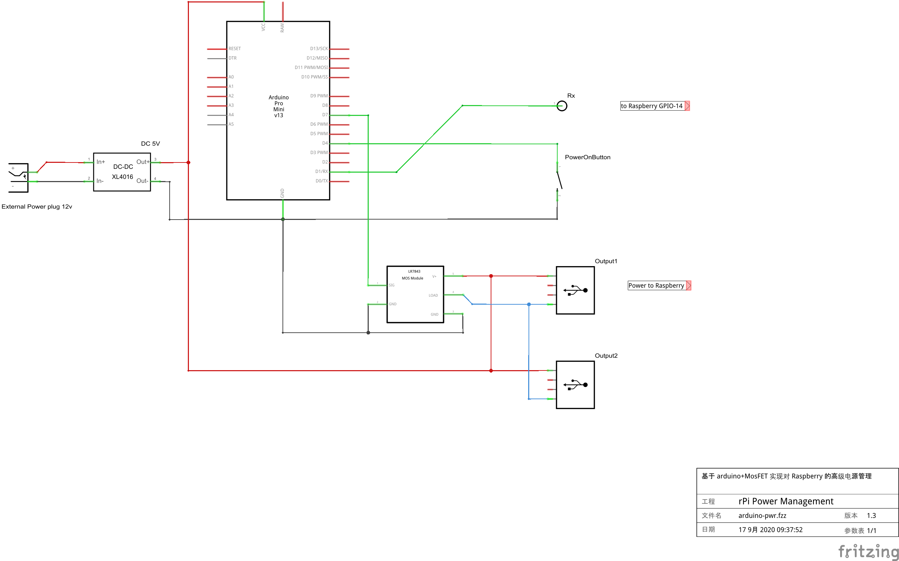

# 起因


一直以来，我们都是通过插拔电源的手动方式来控制树莓派的启停，加电即开机，关机却不断电，彷佛回到2000年左右，在586横行的年代，执行关机命令后，等待屏幕提示然后按下开关关闭电源，这个姿势实在不够优雅！

# 方案

所以我决定为树莓派设计一套简单的自定义硬件模块（类似于ATX/ACPI电源管理），可以很好的解决这个电源管理的麻烦，并分享我的解决方案。

## 设计目标

- 无需树莓派中运行任何程序或触发

- 基于低廉的硬件设施，并易于组装实现

- 参考ATX/ACPI电源特点

- 长时间、低功率、高可靠的运行

不能满足以上要求的电源管理都是耍流氓，以上任何一条都是该方案严格遵守的，亦是方案优点。

## 功能特性

1. 按下电源按钮优雅开机，而不是上电立即开机
2. 树莓派关机后，延迟20秒后自动断电，而不是插拔电源
3. 在供电期间，长按电源按钮可以强制断电
4. 在延迟断电期间，按下电源按钮取消延迟断电

这是已实现的特性，以后会考虑升级软硬件方案增加更多特性。

## 原理图



## 所需模块

- 大功率 DC-DC 降压模块（如果是直接DC5V供电则不需要）
- Arduino Pro Mini (5V, 16MHz)
- LR7843 MosFET (或其它大功率Mos管)
- 按钮、插头、导线等

## 状态机

```
  
                    ┌─────────────┐
                    │  POWER_OFF  │
                    └──────┬──────┘
                           │ <press button>
                      ┌────┴─────┐
                      │ POWER_ON ├────────────────────────────────────┐
                      └────┬─────┘                                    │
                           │                                          │
                ┌──────────┴───────────┐                              │
   <long press> │                      │ <serial command>             │
                │             ┌────────┴───────────┐                  │
                │             │  POWER_OFF_PENDING │                  │
                │             └────────┬───────────┘                  │
                │       <timer>        │       <press button>         │
                │     ┌────────────────┴──────────────────────────────┘
                │     │                
           ┌────┴─────┴────┐                          
           │   POWER_OFF   │                 
           └───────────────┘
  
```

## 触发条件

该电源管理的核心就是状态转换，选择可靠并易实现的条件边缘是方案成功的核心因素：

### 供电

- 按钮触发
- *定时触发（TODO 需要RTC时钟模块）* 

### 断电

- 按钮触发
- 串口终端的 Kernel log
- *通过霍尔电流传感器（TODO）*

# 如何安装

1. 按照原理图安装好电路模块，注意引脚连线
2. 向 `Arduino` 写入本仓库提供的 `rPiPwrMngt.ino` 程序
3. 通过 `raspi-config` 打开树莓派串口

